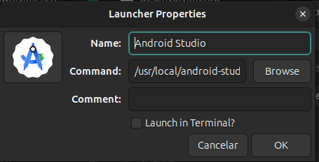
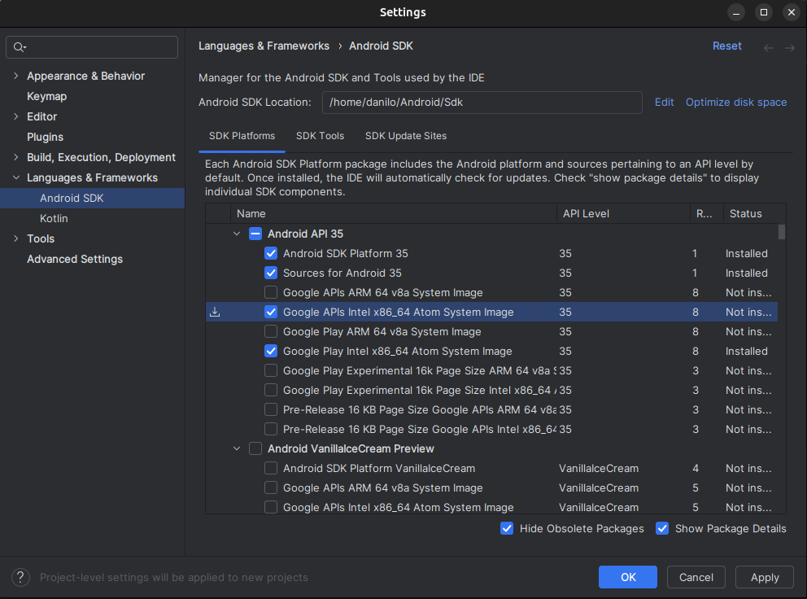
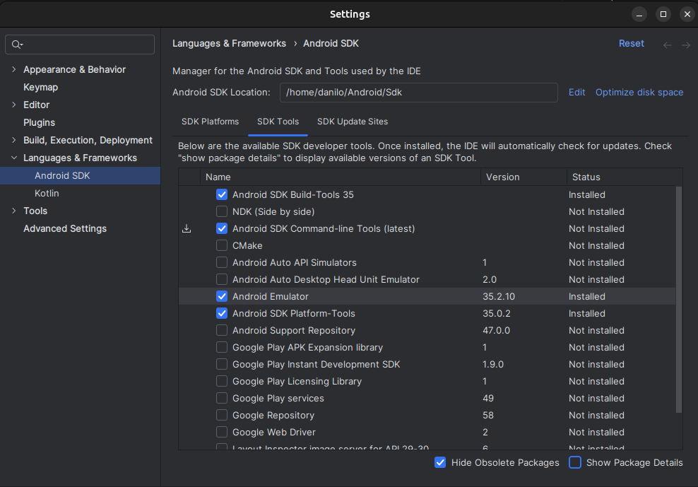
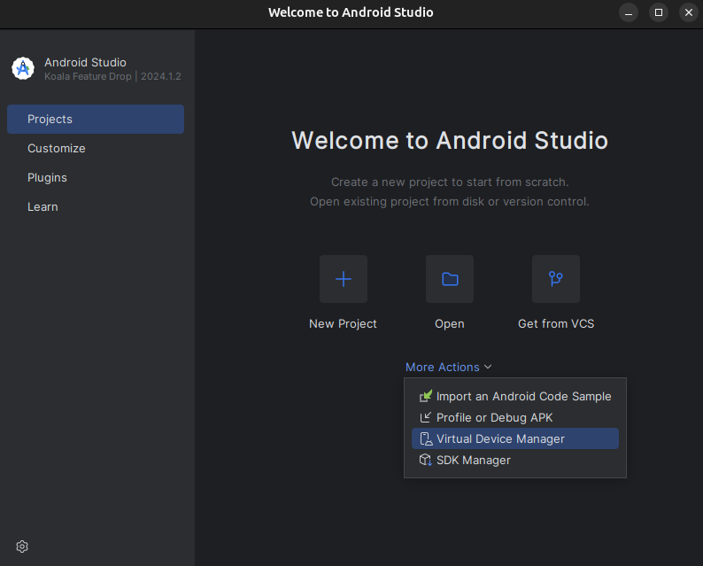
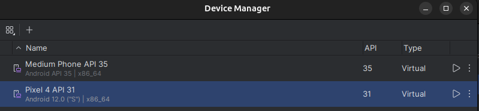

# React Native: Desenvolva APPs Nativas para Android e iOS

Aprenda os fundamentos de React Native, boas práticas e construa várias aplicações nativas para Android e iOS usando JS!

Seja muito bem vindo ao Curso React Native: Desenvolva APPs Nativas para Android e iOS!

Nesse curso, iremos abordar o desenvolvimento de aplicações nativas para dispositivos móveis (Android e iOS), utilizando apenas o JavaScript como linguagem de programação. Isso mesmo, você pode usar o mesmo código para ter aplicações em ambos os ecossistemas.

O curso abrange os fundamentos do React e seu ciclo de vida, criação de componentes, Redux e flexbox. Além do básico do React, apresentaremos o que muda para o React Native, como montar o seu ambiente de desenvolvimento, as especificidades de cada plataforma e como trabalhar com ambas utilizando o mesmo projeto. Também vamos utilizar vários recursos amplamente utilizados no mundo mobile, como: Câmera, ações de toque e gestos, Navegações diversas, Menu, Splash e muito mais.

## Lições Aprendidas

- [x] Base sólida de Javascript com os novos recursos da linguagem
- [x] Fundamentos e ciclo de vida do React
- [x] Entender como estilizar sua aplicação com Flexbox
- [x] Criar projetos de aplicações reais, com layouts atrativos
- [x] Criar rotas, eventos de swipe, trabalhar com imagens, câmeras e diversas outras funcionalidades
- [x] Integrar suas aplicações com Redux
- [x] Criar e integrar a aplicação com um servidor backend em NodeJs, utilizando banco relacional
- [x] Integrar a aplicação com banco NoSQL, utilizando o Firebase

## Requisitos

Conhecimento básico de JavaScript.

## Para quem é este curso:

- Programadores que conhecer o React que desejam ampliar seu uso para dispositivos móveis
- Programadores em geral que desejam aprender os conceitos e ciclo de vida do React Native
- Programadores de aplicações móveis que gostariam de criar aplicações para Android e iOS com uma linguagem apenas

### Preparação do Ambiente - Linux

Precisamos realizar a **instalação** e **configuração** do **Android Studio** para que possamos criar os nossos primeiros aplicativos. E para isso siga os passos abaixo:

#### Passo 1 - Instalando as dependências do Android Studio

Execute os comandos abaixo:

```sh
sudo apt install default-jdk
```

Após a instalação do **Java**, realize a instalação do [**Android Studio**](https://developer.android.com/studio/install?hl=pt-br):

```sh
sudo apt-get install libc6:i386 libncurses5:i386 libstdc++6:i386 lib32z1 libbz2-1.0:i386
```

#### Passo 2 - Instalando o Android Studio

Após baixar o arquivo *"android-studio-2024.1.2.12-linux.tar.gz"* e extrair os dados, entre na pasta onde as informações foram extraidas e execute o comando:

```sh
cp -r android-studio/ /usr/local
```

Em seguida precisamos instalar o pacote **alacarte** via terminal:

```sh
apt-get install alacarte
```

#### Passo 3 - Configurando o Android Studio 

Depois disso vamos ao aplicativo chamado **Menu Principal** e configurar o atalho para o *Android Studio*:



Observação: o valor do "command" é `/usr/local/android-studio/bin/studio.sh`.

Na tela de boas-vindas do **Android Studio** vá em **SDK Manager** , clique no item "**Show Package Details**", clique no tem **Google APIs Intel x86_64 Atom System Image** e depois clique no botão **Apply**:



Após concluir a instalação vá em **SDK Tools** e clique no item "**Android SDK Command-line Tools (latest)**" e depois clique no botão **Apply**:



#### Passo 4 - Configurando o Dispositivo Virtual - Android Studio 

Na tela inicial do Android Studio vá em "**More Actions**" > "**Virtual Device Manager**":



Depois disso clique no sinal de "+" e escolha o dispositivo "**Pixel 4**" com o "**Android S**". Após a instação e configuração, dê o "play" no dispositivo criado, pois vamos utilizar ele para estar as aplicações feitas com **React Native**:



#### Passo 5 - Evitando Problemas

Queremos evitar o famoso [troubleshooting](https://reactnative.dev/docs/troubleshooting) ao iniciarmos o nosso projeto feito com **React Native**, e para isso precisamos executar o seguinte comando:

```sh
echo fs.inotify.max_user_watches=582222 | sudo tee -a /etc/sysctl.conf && sudo sysctl -p
```

Após isso precisamos instalar o **React Native** de forma global no nosso sistema, com o comando:

```sh
npm install react-native -g
```

Crie um novo projeto:

```sh
npx react-native init primeiroProjeto
```

E em seguida inicie o projeto:

```sh
npx react-native start
```

E em um outro terminal execute o comando:

```sh
npx react-native run-android
```

## Fonte

 - [curso-react-native](https://www.udemy.com/course/curso-react-native)